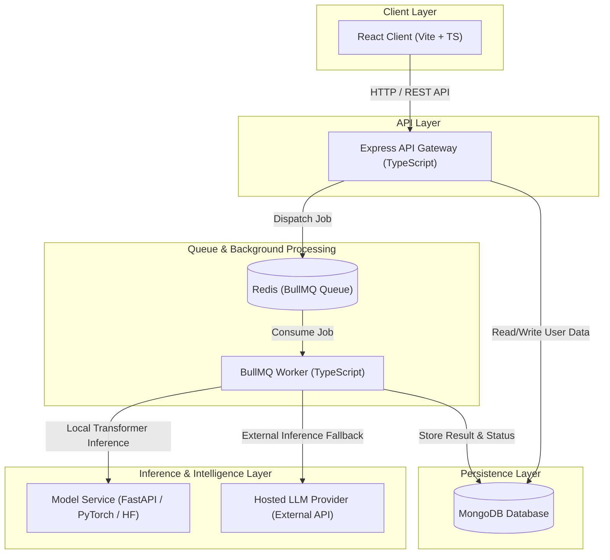

# VeriSumm System Architecture

## Overview

VeriSumm is designed with an event-driven, decoupled microservice architecture to isolate compute-heavy local LLM/transformer inference workloads from the web API server, ensuring high availability and responsive user interactions.

## System Flow & Component Diagram

## Service Responsibilities

1. **React Client (`frontend/`)**: Modern UI for clinicians and researchers to submit documents, review summaries, and monitor job progress in real-time.
2. **Express API (`backend/`)**: Manages authentication, request validation (Zod), MongoDB persistence, and job queue dispatching.
3. **BullMQ Worker (`worker/`)**: Offloads asynchronous summarization jobs, handling retries, fallback logic, and result processing.
4. **Model Service (`model-service/`)**: Isolated Python microservice executing local Hugging Face transformer models (e.g. Clinical-BERT, BioBART, Med-PaLM) for privacy-preserving local inference.
5. **MongoDB (`mongo`)**: Primary database storing user accounts, clinical documents, generated summaries, and audit logs.
